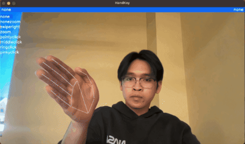
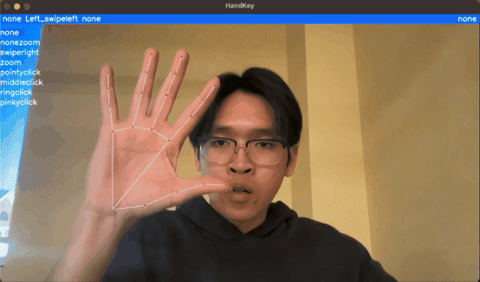
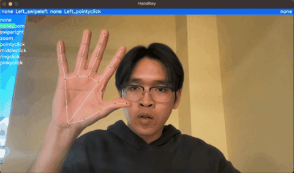
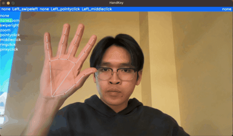
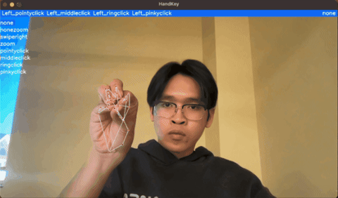
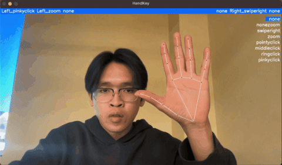
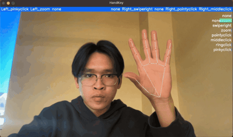
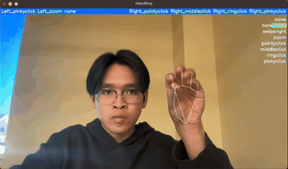
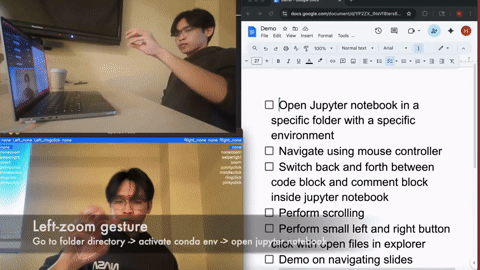
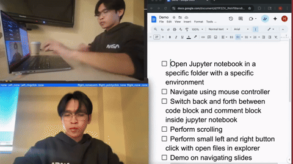

# 🖐️ Handkey – Gesture-Controlled Computer Interaction
#### Handkey is a machine-learning–powered application that lets you control your computer using hand gestures and movement.
Trained on 12 distinct gesture classes, Handkey recognizes dynamic hand movements in real time and maps them to custom shortcuts, commands, actions and mouse movement — giving you a completely touch-free control experience.

## 🚀 Features

- 🎯 **12 Well-Trained Gestures** – Each gesture is recognized with high confidence and minimal latency.  
- 💡 **Custom Action Mapping** – Bind any gesture to actions like:
  - Keyboard shortcuts  
  - Mouse control  
  - Opening files or folders  
  - Typing preset text  
- ⚙️ **Real-Time Detection** – Runs smoothly on standard hardware using OpenCV and TensorFlow.  
- 🧠 **Optimized ML Model** – LSTM/GRU-based sequence classifier trained on thousands of gesture samples with rotation and lighting augmentation.  
- 💻 **Cross-Platform Ready** – Works on macOS, Windows, and Linux.  
- 🧩 **Modular Design** – Easy to integrate with other automation tools.

## 📹 Continoues Real Application Demo Videos (NO CUT)
The video is edited with the overlayed video from another camera perspective to showcase the product (but the whole video length is not cut or interrupted)

[https://github.com/AndyHuynh24/HandKey/issues/1#issue-3579983604](https://github.com/user-attachments/assets/874403e4-094d-43fe-b69d-a0671dce15b1)

## 🎯 Gesture Showcase

|  |  |  |
|:--:|:--:|:--:|
| Left_swipe | Left_pointyclick | Left_middleclick |

|  |  |  |
|:--:|:--:|:--:|
| Left_ringclick | Left_pinkyclick | Left_zoom |

|  |  |  |
|:--:|:--:|:--:|
| Right_swipe | Right_pointyclick | Right_middleclick |

|  |  |  |
|:--:|:--:|:--:|
| Right_ringclick | Right_pinkyclick | Right_zoom |

## 🖥️ Real-Life Application Demo with Action Mapping

This section showcases how **Handkey** maps detected gestures to real computer actions —  
including keyboard shortcuts, typing, mouse control, and file operations.

|  |  |  |
|:--:|:--:|:--:|
| **Perform One Shortcut**   (Ctrl + right arrow) | **Open App**   (*Open App → Type  → Enter*) | **Perform Series of Shortcuts**   (*Open App → Type  → Enter*) |

|  |  | |
|:--:|:--:|:--:|
| **Mouse Control**   (move, click) | **Scroll up/down**   (Hold the gestuer for scrolling up and down) |  |

## 🧰 Tech Stack

